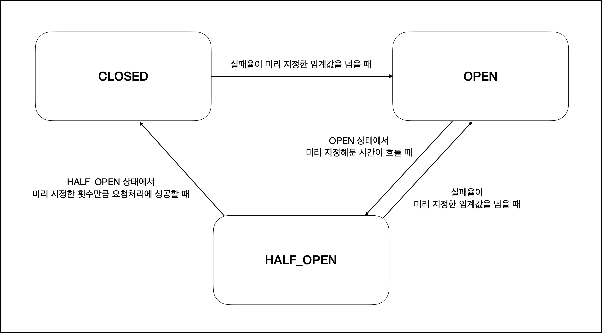
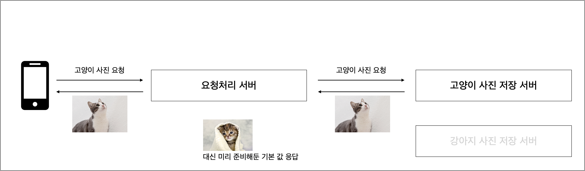
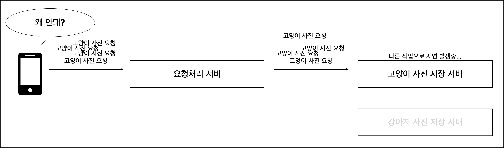
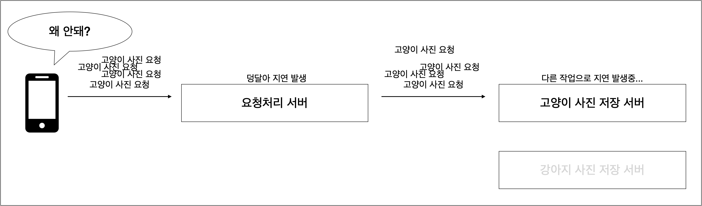
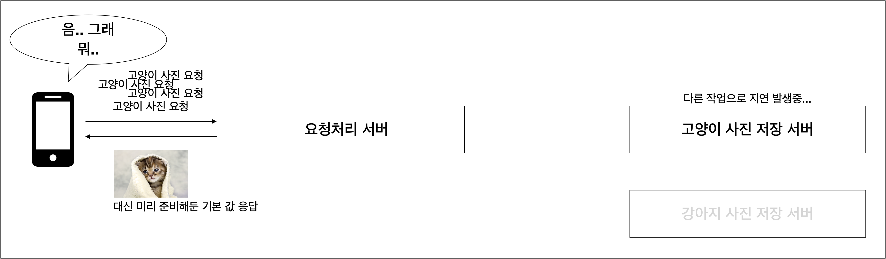

## Circuit Breaker

###**Circuit Breaker** 
* 누전 차단기, <u>외부 API 통신의 장애 전파를 막기 위해 장애를 탐지하면 외부와의 통신을 차단하는 역할</u>
* MSA에서는 서로의 모듈이 의존함에 따라 **한 모듈이 장애가 나면 다른 모듈에도 장애로 이어지는 것을 막기 위해 MSA 회복성 패턴 중 하나인 CurcuitBraker**를 사용한다
* 장점 : 서킷브레이커가 실행(오픈)되면 Fail Fast함으로써 외부 서비스가 장애가 나더라도 빠르게 에러를 응답 받을 수 있다.

###**Circuit Breaker**의 구성
1. 외부 API 통신 시도
2. 외부 통신이 실패함으로써 서킷브레이커 Open
3. Open과 동시에 외부 서버에 요청을 날리지 않고, Fail Fast로 빠른 응답 리턴
4. 서킷 브레이커가 오픈하면 일정 시간 후에 반오픈 상태(Half-Open) 상태
5. 반오픈 상태에서 다시 외부 서비스를 호출해서 장애를 확인하면 Open, 정상 응답이면 닫힘
* 총 (n)번의 통신 중 실패율(n%)를 지정할 수 있다 => "장애 확인"이 가능
* ex) 10번 중 50% => 10번 중 6번이 에러로 발생하면 서킷 브레이커가 Open됨

  * 3가지 상태에 대한  FSM(Final State Machine)을 기반으로 동작함.
    * CLOSED : circuit breaker로 감싼 내부 프로세스가 요청과 응답을 정상적으로 주고 받을 수 있는 상태
    * OPEN : circuit breaker로 감싼 내부 프로세스가 요청과 응답을 정상적으로 주고 받을 수 없는 상태
      * circuit breaker는 미리 지정해준 fall back 응답을 수행할 수 있다.
      * 또는 event publisher를 이용해서 이벤트를 발생시킬 수도 있다.
    * HALF_OPEN : fall back 응답을 수행하고 있지만 실패율을 측정해서 CLOSE 또는 OPEN으로 변경될 수 있는 상태
  * 요청의 성공과 실패에 대한 metric을 수집하고, 미리 지정해둔 조건에 따라 상태가 변화한다. 그 외에도 metric을 수집하지 않는 2가지 특수 상태가 존재함.
    * DISABLED : circuit breaker를 강제로 CLOSED한 상태. metric을 수집하지 않고 상태 변화도 없다.
    * FORCED_OPEN : circuit breaker를 강제로 OPEN한 상태. metric을 수집하지 않고 상태 변화도 없다.

### CircuitBreaker 라이브러리
<table>
    <tr><th>종류</th><th>자바 버전</th><th>특징</th></tr>
    <tr><th>Netflix Hystrix</th><td>Java 6</td><td>개발을 중단하고 유지보수 상태</td></tr>
    <tr><th>Resilience4j</th><td>Java 8</td><td>다른 라이브러리와의 의존성이 없음</td></tr>
</table>
=> Resilience4j로 진행

##### 예제
1. 동물 사진 요청 시 각 동물 사진을 저장 서버로부터 가져와 응답해준다.
  
   * 요청 처리 서버에서 circuit breaker를 사용하며, 때문에 요청 중 예외가 발생하거나 circuit breaker가 OPEN이 되었을 때 응답을 내릴 수 있는 기본 이미지가 준비되어 있다.
2. 고양이 사진 저장 서버에서 지연 발생 + 덩달아 앞단 요청처리 서버 또한 지연이 시작됨.
  
  
3. 2와 같은 경우에 circuit breaker를 통해 고양이 사진 저장 서버로 요청을 차단하고 미리 지정해둔 fall back 응답을 사용하면, 사용자에게 장애 상황임을 노출하지 않을 수 있고, 요청처리 서버의 응답지연도 방지할 수 있다.
  

##### Circuit breaker VS retry 
* circuit breaker: 요청들의 추이를 지켜보다가 지속적으로 실패하는 경우, 잠시 <u>요청을 차단</u>해서 장애를 전파하지 않도록 한다.
  * 일시적인 장애가 아닌 경우, circuit breaker 를 통해 장애를 전파하지 않도록 차단하는 것이 좋다.
* retry: 하나의 요청에 대해, 요청이 실패했을 경우 해당 요청을 다시 시도한다. 계속 실패할 경우 다른 응답을 반환한다.
  * 일시적인 장애(네트워크 순단, DB 장애)를 대응하기 위해 사용함.

### 참조 및 출처
* circuit-breaker 설명 및 적용 예제 - 1 : https://velog.io/@hgs-study/CircuitBreaker
* circuit-breaker 설명 및 적용 예제 - 2 : https://hyeon9mak.github.io/spring-circuit-breaker/
  * circuit-breaker와 retry의 차이 : https://hyeon9mak.github.io/spring-retry/
* spring boot와 spring cloud의 버전 조합 : https://spring.io/projects/spring-cloud#overview
* RestTemplate-vs-WebClient 참조 : https://velog.io/@emotional_dev/RestTemplate-vs-WebClient
  * webflux + webClient + circuit-breaker 예제 : https://gardeny.tistory.com/46    
  * webClient 기본 예제 : https://blog.naver.com/seek316/223337685249
  * webClient 기본 이론 : https://gngsn.tistory.com/154
  * TODO )
    * WebClient에서 에러 처리와 재시도하는 방법 : https://dkswnkk.tistory.com/708
    * WebClient + Retry + CircuitBreaker : https://yangbongsoo.tistory.com/99